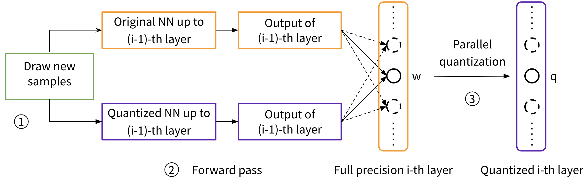

# Post-training Quantization for Neural Networks with Provable Guarantees

#### Authors: [Jinjie Zhang](https://jayzhang0727.github.io/) (jiz003@ucsd.edu), [Yixuan Zhou](https://yixuanseanzhou.github.io/) (yiz044@ucsd.edu) and [Rayan Saab](https://mathweb.ucsd.edu/~rsaab/) (rsaab@ucsd.edu)

## Overview 
This directory contains code necessary to run a post-training neural-network quantization method GPFQ, that
is based on a greedy path-following mechanism. One can also use it to reproduce the experiment results in our paper ["Post-training Quantization for Neural Networks with Provable Guarantees"](https://arxiv.org/abs/2201.11113). In this paper, we also prove theoretical guarantees for the proposed method, that is, for quantizing a single-layer network, the relative square error essentially decays linearly in the number of weights – i.e., level of over-parametrization. 



If you make use of this code or our quantization method in your work, please cite the following paper:

	 @article{zhang2022post,
		title={Post-training Quantization for Neural Networks with Provable Guarantees},
		author={Zhang, Jinjie and Zhou, Yixuan and Saab, Rayan},
		journal={arXiv preprint arXiv:2201.11113},
		year={2022}
		}

*Note:* The code is designed to work primarily with the ImageNet dataset. Due to the size of this dataset, it is likely one may need heavier computational resources than a local machine. Nevertheless, the experiments can be run, for example, using a cloud computation center, e.g. AWS. When we run this experiment, we use the `p3.8xlarge` EC2 instance with a disk space of `300GB`. GPUs can significantly accelerate quantization and inference (20 times faster than CPUs).

## Installing Dependencies
We assume a python version that is greater than `3.8.0` is installed in the user's 
machine. In the root directory of this repo, we provide a `requirements.txt` file for installing the python libraries that will be used in our code. 

To install the necessary dependency, one can first start a virtual environment
by doing the following: 
```
python3 -m venv .venv
source .venv/bin/activate
```
The code above should activate a new python virtual environments.

Then one can make use of the `requirements.txt` by 
```
pip3 install -r requirements.txt
```
This should install all the required dependencies of this project. 

## Obtaining ImageNet Dataset

In this project, we make use of the Imagenet dataset, 
in particular, we use the ILSVRC-2012 version. 

To obtain the Imagenet dataset, one can submit a request through this [link](https://image-net.org/request).

Once the dataset is obtained, place the `.tar` files for training set and validation set both under the `data/ILSVRC2012` directory of this repo. 

Then use the following procedure to unzip Imagenet dataset:
```
# Extract the training data and move images to subfolders:
mkdir ILSVRC2012_img_train
mv ILSVRC2012_img_train.tar ILSVRC2012_img_train 
cd ILSVRC2012_img_train 
tar -xvf ILSVRC2012_img_train.tar && rm -f ILSVRC2012_img_train.tar
find . -name "*.tar" | while read NAME ; do mkdir -p "${NAME%.tar}"; tar -xvf "${NAME}" -C "${NAME%.tar}"; rm -f "${NAME}"; done

# Extract the validation data:
cd ..
mkdir ILSVRC2012_img_val
mv ILSVRC2012_img_val.tar ILSVRC2012_img_val && cd ILSVRC2012_img_val
tar -xvf ILSVRC2012_img_val.tar && rm -f ILSVRC2012_img_val.tar
``` 

## Running Experiments

The implementation of GPFQ and its sparse mode in our paper is contained in `src/main.py`. 

1. Before running the `main.py` file, navigate to the `logs` directory and run `python init_log.py`. This will prepare a log file `Quantization_Log.csv` which is used to store the results of the experiment. 

2. Open the `src` directory and run `python main.py -h` to check hyperparameters, including the number of bits/batch size used for quantization, the scalar of alphabets, the probability for subsampling in CNNs, and regularizations used for sparse quantization etc.

3. To start the experiment, we provide an example: If we want to quantize the ResNet-18 using ImageNet data with bit = 4, batch_size = 512, scalar = 1.16, then we can try this:
```
python main.py -model resnet18 -b 4 -bs 256 -s 1.16
```
There are other options we can select, see `main.py`.

## Examples of Quantized Models 

Use this [link](https://drive.google.com/drive/folders/1M1xioh_YrFXwsNtNpOEjLPbQogL1Llh-?usp=sharing) (Google Drive) to review and download quantized models (alexnet, vgg16, resnet18, resnet50) that are generated by our quantization method with different bits. The choice of all parameters is indicated by the model file name. 

Please open Readme.ipynb for more details. 